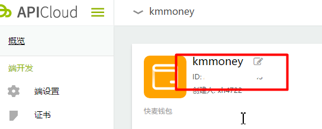
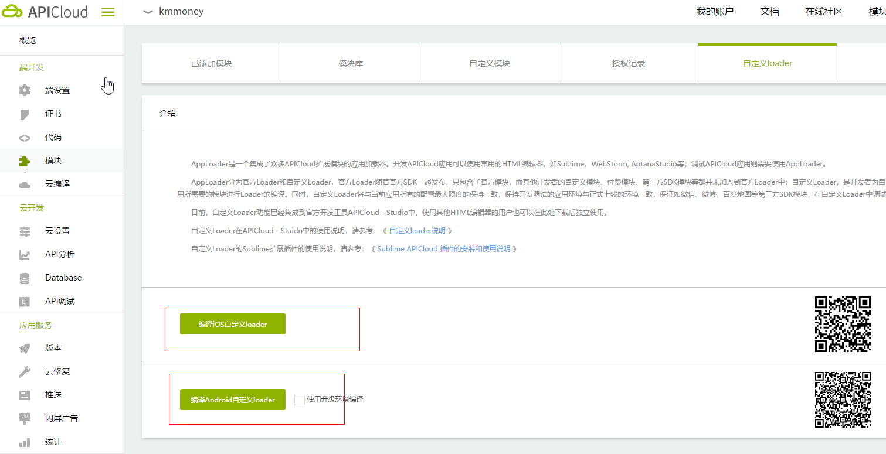
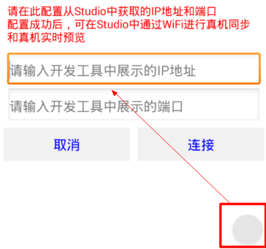
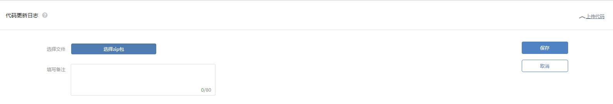
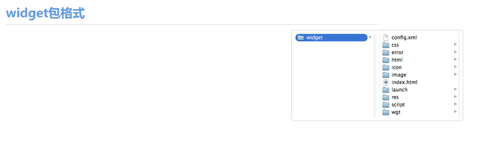
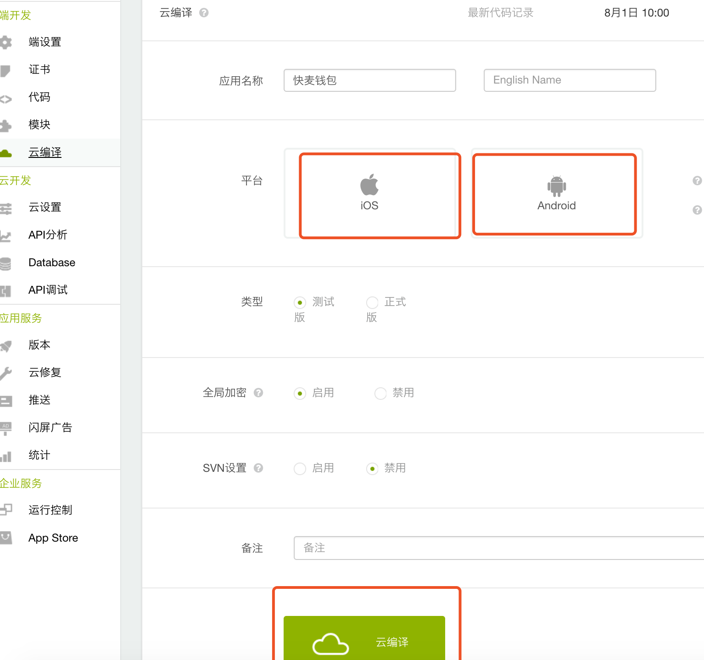

关键点是如何将2者无缝的结合？

这里面就涉及到apicloud的机制。

apicloud最核心的点，项目里面必须有config.xml。

看下官方的[默认模板](https://docs.apicloud.com/Dev-Guide/widget-package-structure-manual)


[配置信息](https://docs.apicloud.com/Dev-Guide/app-config-manual)
```xml
 <widget id="XXXX"  version="0.0.1">
    <name>快麦钱包</name>
    <description>
        快麦钱包
    </description>
    <author email="yanjunqiang@raycloud.com" href="http://www.raycloud.com">
        Developer
    </author>
    <content src="index.html" />
    <access origin="*" />
    <preference name="userAgent" value="https://lingshou.kuaimai.com"/>
    <preference name="pageBounce" value="false"/>
	<preference name="appBackground" value="rgb(255, 255, 255)"/>
	<preference name="windowBackground" value="rgb(255, 255, 255)"/>
	<preference name="frameBackgroundColor" value="rgb(255, 255, 255)"/>
	<preference name="hScrollBarEnabled" value="false"/>
	<preference name="vScrollBarEnabled" value="false"/>
	<preference name="autoLaunch" value="true"/>
	<preference name="fullScreen" value="false"/>
	<preference name="autoUpdate" value="true" />
	<preference name="smartUpdate" value="false" />
	<preference name="debug" value="true"/>
	<preference name="statusBarAppearance" value="true"/>
	<permission name="readPhoneState" />
	<permission name="camera" />
	<permission name="record" />
	<permission name="location" />
	<permission name="fileSystem" />
	<permission name="internet" />
	<permission name="bootCompleted" />
	<permission name="hardware" />
</widget>

```

**content** 是运行的起始页，支持相对/绝对路径。利用这一点，可以把content改成`http://xxxx:8080`, 就能够运行vue的项目了。

这里就能解释了新建项目之后里面会有一个`_apiConfig.xml`文件


## 新建apicloud项目

apicloud会默认帮用户新建初始模板，得通过svn去拉取代码，不合理，我们将摒弃这种方式。

在apicloud新建一个项目之后，，

apicloud会有一个id。

将`_apiConfig.xml`里面的id配置项，替换成新建项目的id。


## 自定义apicloud-loader

我们需要把vue的页面，放在apicloud容器里面。

先构建自定义loader，， 下载安装到手机或者模拟器。


## [apicloud-cli](https://docs.apicloud.com/Dev-Tools/apicloud-cli)

在安装自定义loader之后，按照如图所示，

这个时候就需求apicloud-cli了，2个步骤

wifi开启同步
`apicloud wifiStart --port 8686` 或者 `npm run wifistart`

wifi服务同步所有文件
`apicloud wifiSync --project ./src --updateAll true --port 8686` 或者 `npm run wifiupdateall`

这个时候就能在apicloud容器里面运行vue页面了。

注意了这个时候，我们项目是webpack构建的，同步的时候，会同步node_module，会卡爆了，所以需要有`.syncignore`文件用来忽略node_module。

[详细文档](https://docs.apicloud.com/Dev-Tools/apicloud-cli)


## 打包

在web页面写完之后，如何构建一个app呢，之前我们已经摈弃了传统的apicloud方式。

vue打包之后是在dist目录下，而apicloud可以使用[上传文件](https://www.apicloud.com/code)形式。


我们可以将vue dist下的代码和config.xml一起打包成一个zip上传，这样就只要内部维护一个git了，有权限的人进行代码打包和上传。

[打包时候注意下 apicloud的格式是一个widget包裹的形式。](https://docs.apicloud.com/Dev-Guide/widget-package-structure-manual) 


封装了npm命令

`npm run package` 用来构建包。


## 云编译

最后通过[云编译](https://www.apicloud.com/package), 在线打包自己需要的平台App




## 总结

[apicloud官方demo](https://github.com/apicloudcom/APICloud-App-Templates/blob/master/dianping/widget/html/login.html)

```html
<!doctype html>
<html>
    <head>
        <meta charset="utf-8">
        <meta name="viewport" content="maximum-scale=1.0,minimum-scale=1.0,user-scalable=0,width=device-width,initial-scale=1.0" />
        <title>APICloud APP</title>
        <link rel="stylesheet" type="text/css" href="../css/api.css" />
    </head>

    <body>
        <header id="header">
            <div class="back event-back"></div>
            <h1>大众点评网</h1>
            <div class="reg open-win" win="register">注册</div>
        </header>
    </body>
    <script type="text/javascript" src="../script/api.js"></script>
    <script type="text/javascript" src="../script/common.js"></script>
    <script type="text/javascript">
        apiready = function() {
            fnReady();
            fnReadyFrame();
        };
    </script>

</html>
```


apicloud还没有结合现代前端工程，还是之前jQuery方式来写业务。而且官方推荐使用原生模块来搭建页面，这样性能会好点。

但是对于快速迭代，国内机型性能已经有了很大提高等因素，最终选择Vue来快速构建页面，只使用了APICloud提供的端能力，能够满足我们现阶段的需求。


# 【另】配置更改说明

1. browserslist
由于国内的安卓版本比较颗粒化，低版本的手机flex会有兼容问题，设置browserslist为`> 0.01%`, 差不多接近全部了。

2. 本地打包资源路径问题

3. 请求问题

由于apicloud是本地文件模式，页面发起请求会存在跨域问题，打包之后使用window.api.ajax，而在开发环境可以使用$.ajax、axios等

4. vue router 需要去掉 history mode 解决apicloud打包白屏问题
